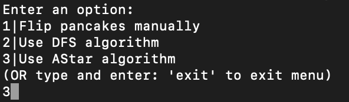
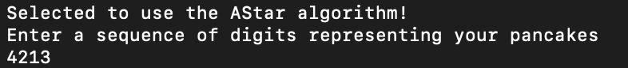
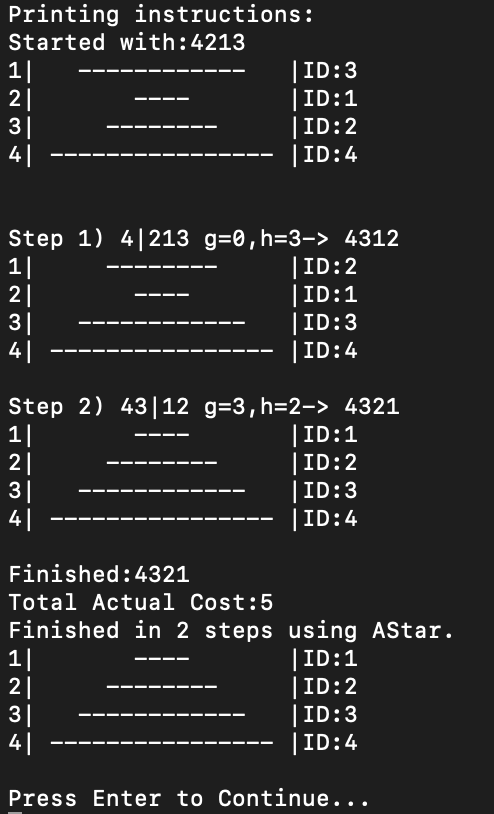

Miguel Zavala
3/19/20
CISC481-Intro to Dear AI
Dr. Raymat

# Instructions for PancakeProblem.py
1) Place PancakeProblem.py in desired directory, navigate to that directory
2) Run PancakeProblem.py by:
```sh
$ python3 PancakeProblem.py
```
3) Type and enter the menu option desired ('1','2','3' or 'exit' to exit)
    * **1:** For manually flipping pancakes without any AI
    * **2:** To use the DFS algorithm 
    * **3:** To use the AStar algorithm
    * **exit:** This exits the program
    
### AStar Example:





Note:
* When prompted to press 'Enter' to continue, you might need to press it twice (python gets stuck)
